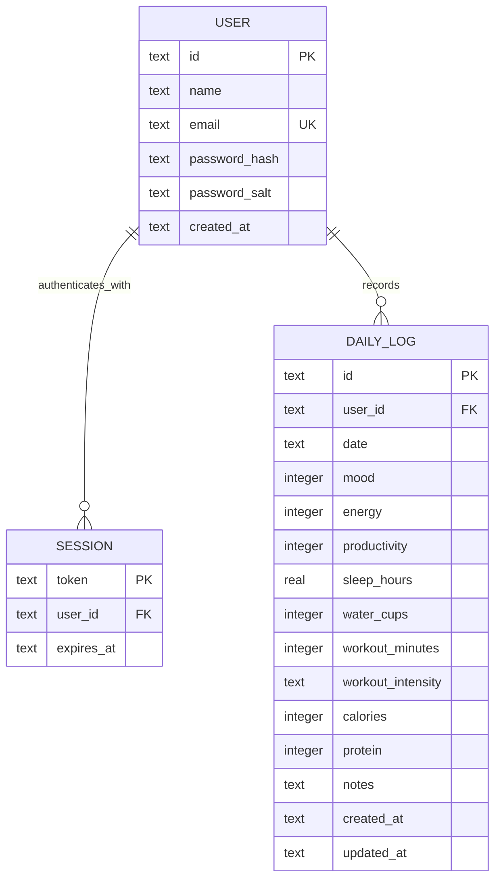

# Capstone Step 4 - Database Model

## Relationship diagram

## Model responsibilities

| Model | Purpose | Main rules |
| --- | --- | --- |
| `users` | Account identity and credential verifier | Email is unique. Passwords are stored as salted `scrypt` hashes, never plain text. |
| `sessions` | Revocable authenticated access | Tokens are random, belong to one user, and expire after seven days. |
| `daily_logs` | One combined wellness observation per day | A user may have only one log per date. Scores are 1-10 and non-score measurements cannot be negative. |

## Relationships and constraints

- One user can have many sessions and daily logs.
- Sessions and logs are deleted when their owning user is deleted.
- The `(user_id, date)` pair is unique.
- The database indexes user/date lookups and session expiration.
- Every read, update, and delete query includes the authenticated user ID to prevent cross-account access.

## Local and deployed representations

The local SQLite schema enforces foreign keys, uniqueness, ranges, and indexes. Netlify Blobs stores equivalent user, session, and log resources as JSON because it is a document store. The deployed API enforces ownership and uniqueness before writes.

## Design decisions

- A combined daily log keeps the primary workflow fast and makes correlation calculations straightforward.
- Food and exercise catalog results are reference data, not user-owned tables. A production integration could add normalized food, meal, exercise, and workout tables.
- Bearer sessions are used for the capstone API. A production browser application should prefer secure, HTTP-only, same-site cookies.
- Correlations are calculated from daily logs rather than stored, preventing stale insight records.

## Future model extensions

- Goals and user preferences
- Meals and foods with macro details
- Workouts and exercise sets
- Password-reset and email-verification tokens
- Consent, export, deletion, and audit records
