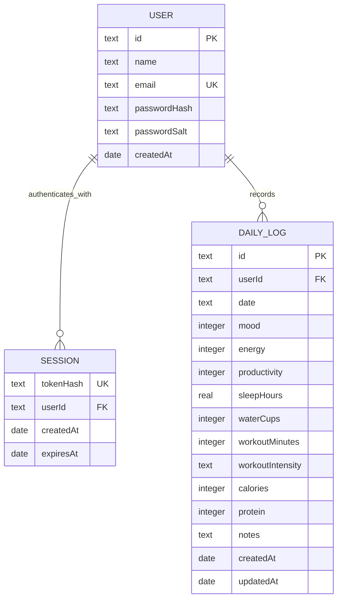

# Capstone Step 4 - Database Model

## Relationship diagram

## Collection responsibilities

| Collection | Purpose | Main rules |
| --- | --- | --- |
| `users` | Account identity and credential verifier | A unique index protects email. Passwords are salted `scrypt` hashes. |
| `sessions` | Revocable authenticated access | Only the token hash is stored. A TTL index removes expired sessions. |
| `dailyLogs` | One combined wellness observation per day | A unique compound index on `(userId, date)` permits one daily log per user. |

## Relationships and constraints

- One user can have many sessions and daily logs.
- Account cleanup explicitly removes sessions and logs belonging to the user.
- The `(userId, date)` pair is unique.
- MongoDB indexes email, hashed tokens, session expiration, and user/date log queries.
- Every read, update, and delete query includes the authenticated user ID to prevent cross-account access.

## Concurrency and correctness

Each user, session, and daily log is a separate MongoDB document. Inserts and updates target one document rather than replacing a shared application-state object. Unique indexes remain authoritative under concurrent requests, preventing duplicate accounts and duplicate logs for the same user/date. This removes the lost-update race that a read-entire-state/write-entire-state Blob design would create.

## Design decisions

- A combined daily log keeps the primary workflow fast and makes correlation calculations straightforward.
- Food and exercise catalog results are reference data, not user-owned tables. A production integration could add normalized food, meal, exercise, and workout tables.
- Browser sessions use secure-in-production, HTTP-only, same-site cookies; MongoDB stores only token hashes, so injected client scripts cannot read live credentials.
- Correlations are calculated from daily logs rather than stored, preventing stale insight records.

## Future model extensions

- Goals and user preferences
- Meals and foods with macro details
- Workouts and exercise sets
- Password-reset and email-verification tokens
- Consent, export, deletion, and audit records
